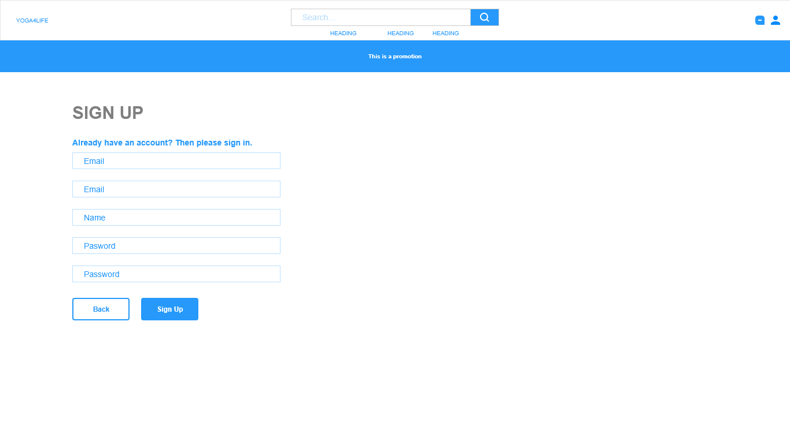
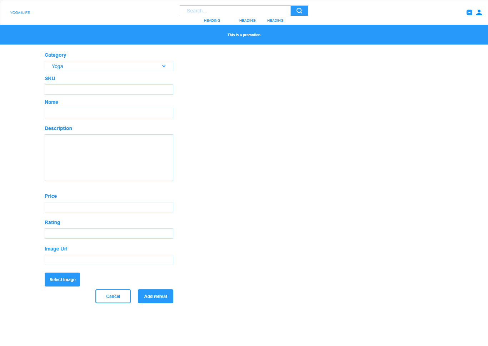
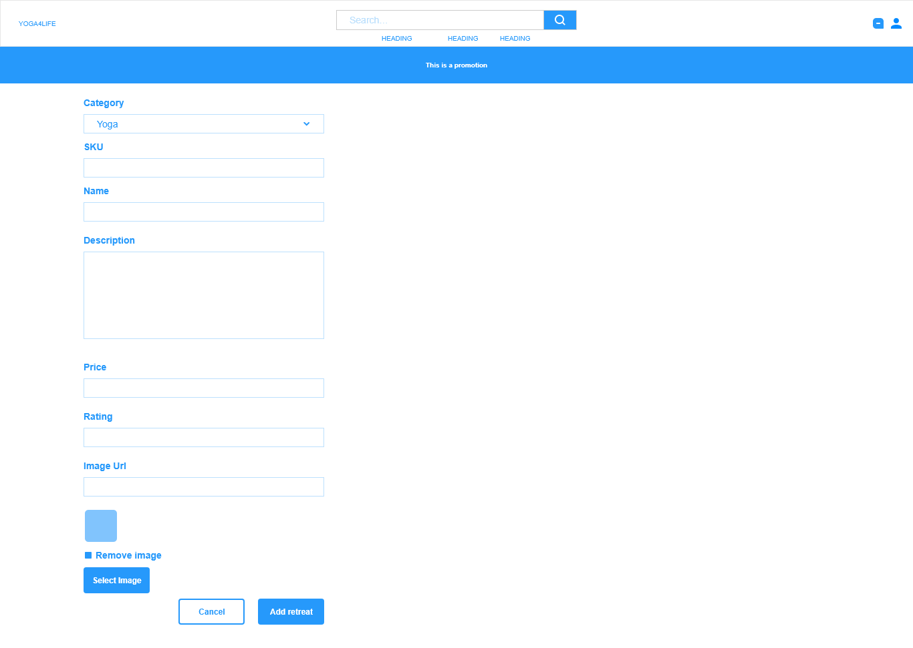
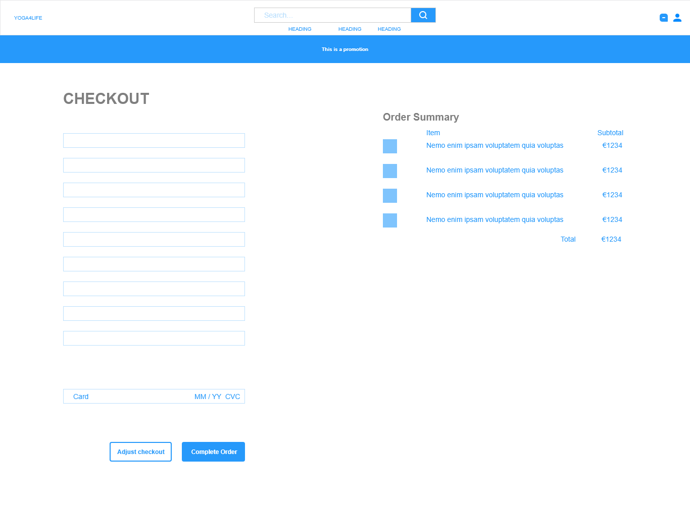

# Milestone Project 4

## Yoga4life - Online yoga studio

#### Membership, dropin classes, eCommerece - Tourotials

## Table of Contents:
* [What does it do and what does it need to fulfill?](#what-does-it-do-and-what-does-it-need-to-fulfill)
* [Functionality of Project](#functionality-of-project)
* [User Experience](#user-experience)
    * [User Stories](#user-stories)
    * [Design](#design)
        * [1. Font](#1-font)
        * [2. Color Scheme](#2-color-scheme)
        * [3. Logo](#3-logo)
        * [4. Geometry](#4-geometry)
        * [5. Wireframing](#5-wireframing)
* [Technology Used](#technology-used)
* [Database](#database)
* [Features](#features)
    * [Future Features](#future-features)
* [Testing](#testing)
    * [Defensive Design](#defensive-design)
* [Deployment](#deployment)
* [Credits](#credits)
    * [Special Thanks & Acknowledgements](#special-thanks--acknowledgements)

***

## Welcome to  Yoga4Life

<p align="center">
    
</p>

***

## What does it do and what does it need to fulfill?
This Milestone project creation is the culmination of learning and study from all modules of the Full Stack Developer Course, culminating in the creation of this Full Stack Framework Django project. This Application will allow an admin to store and manipulate data records and also allow users to create, read, update, delete & purchase retreats and yoga classes. This website is to emulate a Yoga webpage offering retreats and classes to those who practice yoga but offering different places to retreat and yoga classes for all levels. </a>.

<p align="center">
    
</p>

### Functionality of Project
This application contains ....

[Back to top](#table-of-contents)

## User Experience:

#### User Stories:
_Generic (Guest/Public) User:_
* As a Generic User, I want to be able to view the site on multiple devices. (mobile/tablet/desktop).
* As a Generic User, I want to find a yoga retreat that I would like to go on.
* As a Generic User, I want to find yoga classes that are available. 
* As a Generic User, I want to find yoga retreats and browse them.
* As a Generic User, I want to be able to book a yoga retreat.
* As a Generic User, I want to be able to book a yoga class.
* As a Generic User, I want to book and pay using a fast, reliable and trustworthy online system.
* As a Generic User, I want to checkout using card payment.
* As a Generic User, I want to recieve email confirmation with details of my purchase.
* As a Generic User, I want to view reviews from other customers 
* As a Generic User, I want to to be able to leave a review 

_Business (Application Owner/Administrator) User:_ 
* As a Business User, I want to I want to be able to login to an administration panel.
* As a Business User, I want to attract new customers.
* As a Business User, I want to provide all the customers information they need online so that they do need to call and email.
* As a Business User, I want to seemless booking system for customers
* As a Business User, I want to easily take payment from customers
* As a Business User, I want to automatic email notifications for my customers
* As a Business User, I want to be able to add new retreats
* As a Business User, I want to be able to edit retreats
* As a Business User, I want to be able to add new yoga classes
* As a Business User, I want to be able to edit yoga classes

_Registers (Logged in) User:_
* As a Registered User, I want to have the ability to Login to the site via my registered details.
* As a Registered User, I want to create and edit a profile. 
* As a Registered User, I want to be able to see my previous purchases
* As a Registered User, I want to be able to view my Cart and any items I currently have awaiting payment in my Cart.
* As a Registered User, I want to be able to items currently added to my Cart.
* As a Registered User, I want to have the ability to Logout of the application.

#### Design

##### 1. Font
The project has a main font <a href="https://fonts.google.com/specimen/Roboto">Roboto</a> which greatly complement each other throughout the site. “Sans-Serif” is used as the default backup font in cases where these fonts have difficulty loading. Roboto is a user friendly font which give a proper reading in different screen sizes.

“Sans-Serif” is used as the default backup font in cases where these fonts have difficulty loading.


##### 2. Color Scheme
This project went through multiple theme iterations whilst in Wireframe stage. Ultimately, I was always lead back to professional high contrast finish that would normally be seen in most day-to-day apps with a touch of pastel color to highlight to the user the breakaway elements.

*  `#88583d` - Primary color
*  `#fffff` - Secondary color
*  `#dbd4d7` - Secondary color
*  `#0f161f` - Tertiary color
*  `#b28262` - Supplementary color #1
*  `#c6aaa0` - Supplementary color #2


The colours used throughout are based on a  brown colour pallet. 
Brown is a natural color that evokes a sense of strength and reliability. It's often seen as solid, much like the earth, and fits well with the ground experience of yoga.

The primary call to action buttons, the searchbox, and the icons used the primary colour,  , setting the immediate tone for the rest of the application to be professional and aesthetically pleasing. Fonts used throughout the application utilise the tertiary color .
The background, secondary call to action buttons, and the navbar is colored in our Secondary color choice,  , which offered the first splash of vibrant color to contrast the logo and the nav-link elements.
The hero image used the Supplementary color #1  as a baground colour.

##### 3. Logo

<p align="center">
    
</p>

##### 4. Geometry

The applications geometrical aspects...

##### 5. Wireframing

Wireframing for this project were created using AdobeXD. Each page or view of the application was rendered as a wireframe in both Mobile and Desktop viewports to show the difference between the aesthetics and showing how the elements per page would react to differing viewport sizes. 

Initial Wireframes for the site: <a href="https://github.com/TobinWebDesign/Milestone-Project-Data-Centric-Development-Milestone-Project-/tree/master/wireframes">Wireframes</a> 

* Base Template:

The base.html parent template contains the default components that are to be shared with the child templates in the app. All meta tags can be found here as well links to frameworks, stylesheets and scripts. The navbar and mobile header partial components have their own html files and inserted into the base.html
The navbar partial template component contains all primary relevant navigation throughout the site, including a search bar, shopping cart, and Register/Login button.

The base.html parent template ...;
```html

{& endblock %}
```

<details>
<summary>Base Template Wireframes</summary>

<p align="center">
    
</p>

<p align="center">

</p>
</details>

***

* Home Page:

The home (Index) page is our primary landing page and has two call to actions buttons on the left of screen: 1. View retreats 2. View yoga time table.
***

[Back to Top](#table-of-contents)

<p align="center">

</p>
</details>

* Retreat Page:

The Home (Index) Page contained all the major navigation points for the user. It does not contain a hero image to maintain a clean and simple theme not destracting fromt the main focus of the app. A simple heading and subheading defining nature of the application as well as a choice of call to action buttons. 
Below the Latest Recipes are desplayed. 

<details>
<summary>Retreat Wireframes</summary>

<p align="center">
    
</p>

<p align="center">

</p>
</details>

***

* Login Page:

STILL IN PRODUCTION
A simple page as normal inheriting the navbar and footer from the base.html file.

<details>
<summary>Login Wireframes</summary>

<p align="center">
    
</p>

<p align="center">

</p>
</details>

***

* Add retreats/reviews/details Page:


<details>
<summary>Add retreats/reviews/details Wireframes</summary>

<p align="center">
    
</p>

<p align="center">

</p>
</details>

***

* Cart Page:


<details>
<summary>Cart Wireframes</summary>

<p align="center">
    
</p>

<p align="center">

</p>
</details>

***

* Edit Page:


<details>
<summary>Edit Wireframes</summary>

<p align="center">
    
</p>

<p align="center">

</p>
</details>

***

* Checkout Page:


<details>
<summary>Checkout Wireframes</summary>

<p align="center">
    
</p>

<p align="center">

</p>
</details>

***

* reviews Page:


<details>
<summary>reviews Wireframes</summary>

<p align="center">
    
</p>

<p align="center">

</p>
</details>

***

## Technology Used

#### Languages, Frameworks, Editors & Version Control:

* HTML, CSS & Python ~ core languages used to create this multi-page CRUD application.
* <a href="https://getbootstrap.com/"> Bootstrap Framework</a> ~ Used as the core structuring layout for the application, ensuring mobile-first design and screen size fluidity.
* Bootstrap's <a href="https://getbootstrap.com/docs/4.3/getting-started/introduction/#js">Imported Javascript & JQuery</a> ~ For the Modal and Responsive Navbar expand & collapse functionality.
* <a href="https://www.jetbrains.com/pycharm/">PyCharm IDE</a> ~ PyCharm was used as the preferred IDE for this project.
* PyCharm built-in Terminal ~ Used to commit to local repository and further push to Github Repo ensuring adequate version
controlling throughout the life-cycle of the project build.
* <a href="https://git-scm.com/">Git</a> ~ Installed on local device and integrated to PyCharm as a Plugin to enable version controlling.
* <a href="https://github.com/auxfuse/Milestone1">Github</a> ~ Used to host the repository of all previous versions of the build and linked to Heroku to push the latest changes to the deployed build version held there.
* <a href="https://www.heroku.com/">Heroku</a> ~ A cloud platform as a service enabling deployment for this CRUD application.

#### Tools Used:

* [Gitpod](https://www.gitpod.io/) is the IDE used for developing this project.
* [Visual Studio Code](https://code.visualstudio.com/) is the IDE used for developing this project locally when no internet was available. Also for using extensions which proved to be more reliable in VSC than in the more rececently established gitpod e.g. beautifying the code
* [Django](https://www.djangoproject.com/) as python web framework for rapid development and clean design.
* [Stripe](https://stripe.com/gb) as payment platform to validate and accept credit card payments securely.
* [AWS S3 Bucket](https://aws.amazon.com/)  to store static files and images entered into the database.
* [Boto3](https://boto3.amazonaws.com/v1/documentation/api/latest/index.html) to enable creation, configuration and management of AWS S3
* [Django Crispy Forms](https://django-crispy-forms.readthedocs.io/en/latest/) to style django forms.
* [Heroku](https://www.gitpod.io/) Heroku for deployment
* [Django Storages](https://django-storages.readthedocs.io/en/latest/) a collection of custom storage backends with django to work with boto3 and AWS S3.
* [Gunicorn](https://pypi.org/project/gunicorn/)WSGI HTTP Server for UNIX to aid in deployment of the Django project to heroku.
* [Pillow](https://pillow.readthedocs.io/en/stable/)as python imaging library to aid in processing image files to store in database.
* [Psycopg2](https://pypi.org/project/psycopg2/) as PostgreSQL database adapter for Python.
* [PIP](https://pip.pypa.io/en/stable/installing/) for installation of tools needed in this project.
* [Github](https://github.com/) to store and share all project code remotely.
* [Canva](https://www.canva.com/) to edit and crop images.
* [Adobe XD/](https://www.adobe.com/products/xd.html)to create the wireframes for this project.

## Database

#### Database Schema:

Detail the db schema here....images, thoughts behind fks etc

## Features

Yoga4Life app is made up of by 7 different applications: profiles, cart, checkout, search, reviews, classes and retreats. Using MVC architecture from the Django framework, each application holds its own model and viewswhich interact with eachother via the yoga4life folder.

### Cart

* The cart app gives the user the ability to view, add, adjust, and remore retreats and classes to the cart as they wish. 

### Checkout

* The checkout application holds and manipulates the Stripe API. In which empowers the overall application with the e-commerce functionality.

### Classes

* The classes page will display all of the Yoga classes available and a weekly timetable

### Profile

* The profile app allows users to register and add profile which contains login/register pages as well as a user profile page.

### Search

* The search app has a simple search functionality that is used to find different retreats on the web app.

### Admin

* The Admin page

### 404 page

* The Admin page


[Back to Top](#table-of-contents)

#### Future Features:

* Detail future implementations here...

## Testing

Testing django allauth:
* Change LOGIN_REDIRECT_URL to "/success"
* Run the server with "python3 manage.py runserver", open the project, and navigate to /accounts/login. 
* Login using verified username
* Confirm that authentication is working properly when we get 404 page with the /success url.

Testing toasts:
* Go to the add to bag view
* Change the message to use error instead of success.
* Then add something else to the shopping bag.
* Test confirmed as the toast is used the error template.

#### Found Bugs and Fixes:

During manual testing...

[Back to Top](#table-of-contents)

#### Defensive Design

Defensive design for this application was...

## Deployment

Detail deployment here...

[Back to Top](#table-of-contents)

## Credits

* Detail credits
* Photo by Elly Fairytale from Pexels

[Back to Top](#table-of-contents)

#### Special Thanks & Acknowledgements:

* Those in Slack, Tutor Support and my Mentor Spencer Barriball for assisting with me with countless queries since starting on this journey until now.

###### <i>Disclaimer: This project was created for educational use only as part of the Code Institute Full Stack Software Development Course for Milestone 4 Grading!</i>

[Back to Top](#table-of-contents)