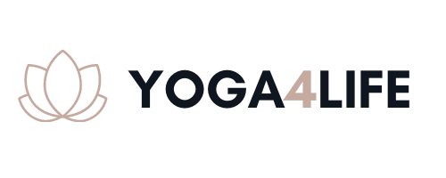

# Milestone Project 4

## Yoga4life - Online yoga studio

#### Membership, dropin classes, eCommerece - Tourotials

## Table of Contents:
* [What does it do and what does it need to fulfill?](#what-does-it-do-and-what-does-it-need-to-fulfill)
* [Functionality of Project](#functionality-of-project)
* [User Experience](#user-experience)
    * [User Stories](#user-stories)
    * [Design](#design)
        * [1. Font](#1-font)
        * [2. Color Scheme](#2-color-scheme)
        * [3. Logo](#3-logo)
        * [4. Geometry](#4-geometry)
        * [5. Wireframing](#5-wireframing)
* [Technology Used](#technology-used)
* [Database](#database)
* [Features](#features)
    * [Future Features](#future-features)
* [Testing](#testing)
    * [Defensive Design](#defensive-design)
* [Deployment](#deployment)
* [Credits](#credits)
    * [Special Thanks & Acknowledgements](#special-thanks--acknowledgements)

***

## Welcome to  Yoga4Life

<p align="center">
    
</p>

***

## What does it do and what does it need to fulfill?
This Milestone project creation is the culmination of learning and study from all modules of the Full Stack Developer Course, culminating in the creation of this Full Stack Framework Django project. This Application will allow an admin to store and manipulate data records and also allow users to create, read, update, delete & purchase memberships for this newly create local barbell club called, <a href="">Yoga4Life
</a>.

<p align="center">
    
</p>

### Functionality of Project
This application contains ....

[Back to top](#table-of-contents)

## User Experience:

#### User Stories:
_Generic (Guest/Public) User:_
 As a Generic User, I want to be able to view the site on any device I may have, (mobile/tablet/desktop).
* As a Generic User, I want to have the ability to register to the site.
* As a Generic User, I want to have the ability to research the business and anything associated with same through the application.
* As a Generic User, I want to have the ability to view the established Accessibility Statement & Privacy Policy if any.
* As a Generic User, I want to be able to view available Membership prices.
* As a Generic User, I want to be able to view available Drop-in prices.
* As a Generic User, I want to be able to get in contact with the business owner through the website.
* As a Generic User, I want to have the ability to see the established social accounts coupled with the business, eg: Facebook, Instagram etc.
* As a Generic User, I want to have information available as to the directions of the business site.

_Registers (Logged in) User:_
* As a Registered User, I want to have the ability to Login to the site via my registered details.
* As a Registered User, I want to have the ability to review membership options and but choose one.
* As a Registered User, I want to be able to view my Cart and any items I currently have awaiting payment in my Cart.
* As a Registered User, I want to be able to items currently added to my Cart.
* As a Registered User, I want to have the ability to Logout of the application.

_Application Owner/Administrator User:_
* As a Site Administrator, I want to be able to login to an administration panel.
* As a Site Administrator, I want to have the ability to update site content, i.e Membership packages.
* As the Owner, I want to ensure any user navigating to my site has a positive User experience between content and responsive design.
* As the Owner, I want to show any user navigating to my site the facilities, services & pricing available.


#### Design

##### 1. Font
The project has a main font of <a href="">Roboto Condensed</a> which is used for primary texts and headers, and a secondary font of <a href="">Lato</a>, both of which greatly complement each other throughout the site.

“Sans-Serif” is used as the default backup font in cases where these fonts have difficulty loading.
Roboto Condensed sports a unique ...

The secondary font of Lato has a natural flow...

##### 2. Color Scheme
This project went through multiple theme iterations whilst in Wireframe stage. Ultimately, I was always lead back to professional high contrast finish that would normally be seen in most day-to-day apps with a touch of pastel color to highlight to the user the breakaway elements.

*  `#b28262` - Primary color
*  `#dbd4d7` - Secondary color
*  `#0f161f` - Tertiary color
*  `#c6aaa0` - Supplementary color #1
*  `#88583d` - Supplementary color #2

The colors used throughout and what for etc....

##### 3. Logo
The logo was ...

<p align="center">
    
</p>

##### 4. Geometry

The applications geometrical aspects...

##### 5. Wireframing

Wireframing for this project began with Pen and paper as all my projects tend to start, but ultimately Wireframes were created using Balsamiq. Each page or view of the application was rendered as a wireframe in both Small and Medium-Large viewports to show the difference between the aesthetics and showing how the elements per page would react to differing viewport sizes. Each element planned out in this stage has made it into the physical build of the application with not much deviation occurring from the original wireframe plans.

* Base Template:

The base.html parent template ...;
```html

{& endblock %}
```

<details>
<summary>Base Template Wireframes</summary>

<p align="center">
    
</p>

<p align="center">

</p>
</details>

***

* Home Page:


***

[Back to Top](#table-of-contents)

## Technology Used

#### Languages, Frameworks, Editors & Version Control:

* HTML, CSS & Python ~ core languages used to create this multi-page CRUD application.
* <a href="https://getbootstrap.com/"> Bootstrap Framework</a> ~ Used as the core structuring layout for the application, ensuring mobile-first design and screen size fluidity.
* Bootstrap's <a href="https://getbootstrap.com/docs/4.3/getting-started/introduction/#js">Imported Javascript & JQuery</a> ~ For the Modal and Responsive Navbar expand & collapse functionality.
* <a href="https://www.jetbrains.com/pycharm/">PyCharm IDE</a> ~ PyCharm was used as the preferred IDE for this project.
* PyCharm built-in Terminal ~ Used to commit to local repository and further push to Github Repo ensuring adequate version
controlling throughout the life-cycle of the project build.
* <a href="https://git-scm.com/">Git</a> ~ Installed on local device and integrated to PyCharm as a Plugin to enable version controlling.
* <a href="https://github.com/auxfuse/Milestone1">Github</a> ~ Used to host the repository of all previous versions of the build and linked to Heroku to push the latest changes to the deployed build version held there.
* <a href="https://www.heroku.com/">Heroku</a> ~ A cloud platform as a service enabling deployment for this CRUD application.

#### Tools Used:

* <a href="">PostgreSQL</a> ~ A free and open-source relational database management system emphasizing extensibility and technical standards compliance. Designed to handle high range of workloads including Web services with many concurrent users.
* <a href="https://mycolor.space/">ColorSpace</a> ~ Used to find complimentary color schemes used throughout the application.
* <a href="http://eye-dropper.kepi.cz/">Eye Dropper (Color Picker)</a> ~ Open Source Google Chrome Extension used to obtain hexadecimal/rgba/hsl values of colours. Built by Kepi (<a href="https://github.com/kepi">Kepi's Github</a>)
* Google Chrome DevTools ~ Used to test the application's functionality, the responsiveness of same, and the CSS visualisation, as well as assisting in such tasks as figuring out the correct style properties to override Bootstraps user agent styling.
* <a href="https://balsamiq.com/">Balsamiq</a> ~ Used for the creation of my pre-build wireframes showing the main elements and differences in size of same through small to large screen sizes.
* <a href="https://realfavicongenerator.net/">Favicon Generator</a> ~ Used to create favicon from custom Logo I created for the project.
* <a href="https://validator.w3.org/">W3C HTML Validator</a> & <a href="https://validator.w3.org/">W3C CSS Validator</a> & <a href="https://jshint.com/">JSHint</a> ~ Used to check the validity and efficiency of my code.
* <a href="https://autoprefixer.github.io/">Autoprefixer CSS Online</a> ~ Used to check for possible webkits required in the applications stylesheet ensuring Cross-browser support.
* <a href="http://pep8online.com/">PEP 8 Online Validator</a> ~ to check my python code to be consistent with PEP8 requirements.
* Adobe Photoshop ~ to create the custom long and short variations of the Logo for this application.
* <a href="https://fontawesome.com/icons?d=gallery">Font Awesome Icons</a> ~ For social icons used in Footer.

## Database

#### Database Schema:

Detail the db schema here....images, thoughts behind fks etc

## Features

The project boasts several key features:
* Create: ...

[Back to Top](#table-of-contents)

#### Future Features:

* Detail future implementations here...

## Testing

Testing django allauth:
* Change LOGIN_REDIRECT_URL to "/success"
* Run the server with "python3 manage.py runserver", open the project, and navigate to /accounts/login. 
* Login using verified username
* Confirm that authentication is working properly when we get 404 page with the /success url.

Testing toasts:
* Go to the add to bag view
* Change the message to use error instead of success.
* Then add something else to the shopping bag.
* Test confirmed as the toast is used the error template.

#### Found Bugs and Fixes:

During manual testing...

[Back to Top](#table-of-contents)

#### Defensive Design

Defensive design for this application was...

## Deployment

Detail deployment here...

[Back to Top](#table-of-contents)

## Credits

* Detail credits
* Photo by Elly Fairytale from Pexels

[Back to Top](#table-of-contents)

#### Special Thanks & Acknowledgements:

* Those in Slack, Tutor Support and my Mentor Spencer Barriball for assisting with me with countless queries since starting on this journey until now.

###### <i>Disclaimer: This project was created for educational use only as part of the Code Institute Full Stack Software Development Course for Milestone 4 Grading!</i>

[Back to Top](#table-of-contents)