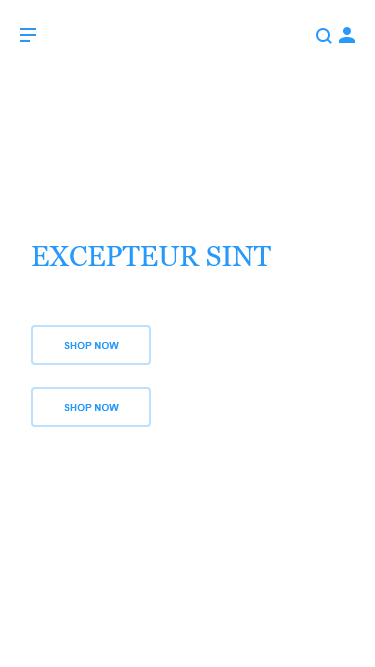
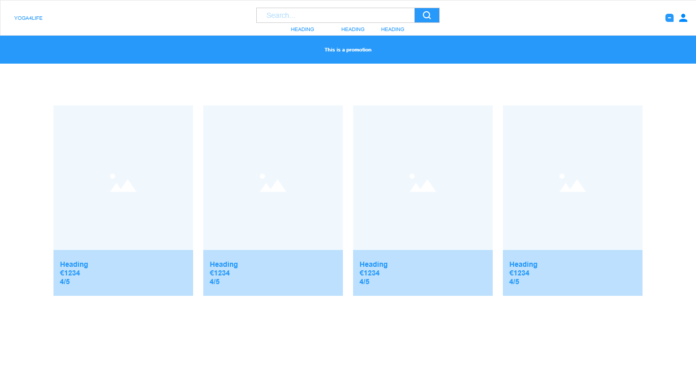
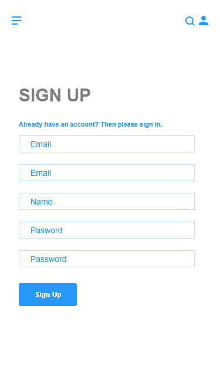
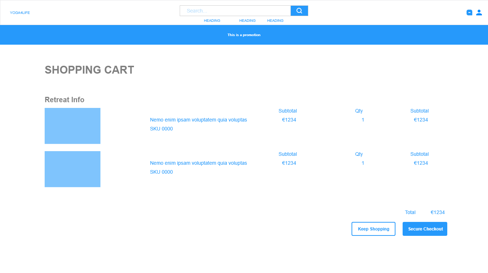
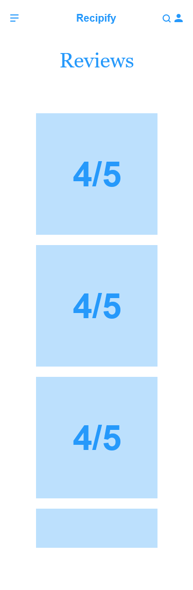
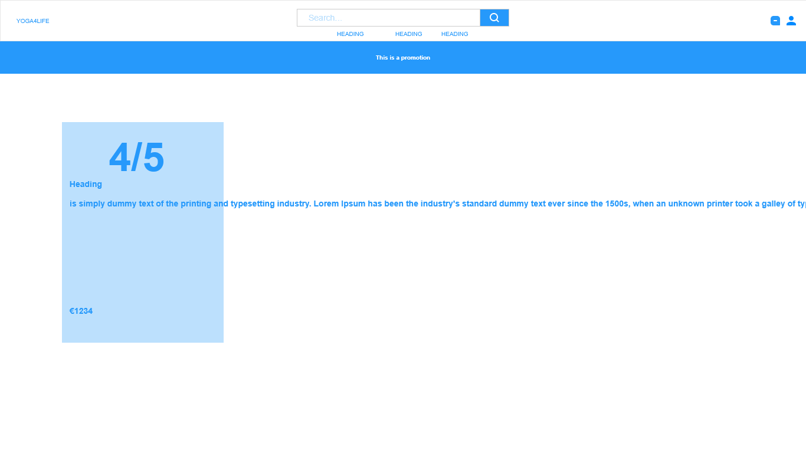
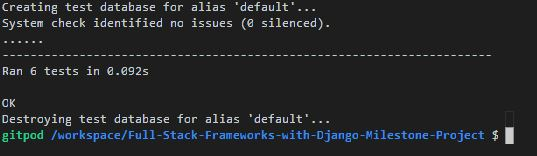

# Milestone Project 4

## Yoga4life - Online yoga studio

#### Membership, dropin classes, eCommerece - Tourotials

## Table of Contents:
* [What does it do and what does it need to fulfill?](#what-does-it-do-and-what-does-it-need-to-fulfill)
* [Functionality of Project](#functionality-of-project)
* [User Experience](#user-experience)
    * [User Stories](#user-stories)
    * [Design](#design)
        * [1. Font](#1-font)
        * [2. Color Scheme](#2-color-scheme)
        * [3. Logo](#3-logo)
        * [4. Geometry](#4-geometry)
        * [5. Wireframing](#5-wireframing)
* [Technology Used](#technology-used)
* [Database](#database)
* [Features](#features)
    * [Future Features](#future-features)
* [Testing](#testing)
    * [Defensive Design](#defensive-design)
* [Deployment](#deployment)
* [Credits](#credits)
    * [Special Thanks & Acknowledgements](#special-thanks--acknowledgements)

***

## Welcome to  Yoga4Life

<p align="center">
    
</p>

***

## What does it do and what does it need to fulfill?
This Milestone project creation is the culmination of learning and study from all modules of the Full Stack Developer Course, culminating in the creation of this Full Stack Framework Django project. This Application will allow an admin to store and manipulate data records and also allow users to create, read, update, delete & purchase retreats and yoga classes. This website is to emulate a Yoga webpage offering retreats and classes to those who practice yoga but offering different places to retreat and yoga classes for all levels. </a>.

<p align="center">
    
</p>

### Functionality of Project
The <a herf="https://yoga4life.herokuapp.com/">Yoga4Life App</a> utilizes Django 3 to empower quick web developlemt taking advantage of Django's claim to fame "The web framework for perfectionists with deadlines.".
Working with Django, sqlite was utilized in the Project's initiation stage as a test database for testing the applications local environment. SQLite is a C-language library that implements a small, fast, self-contained, high-reliability, full-featured, SQL database engine. Once the Yoga4life application was read for deployment on Heroku I transfered the database to PostGreSQL. PostgreSQL is a powerful, open source object-relational database which has a strong strong reputation for reliability, feature robustness, and performance.

The combination of Django and a cdatabase allows for an admin section where one can Create, Read, Update and Delete records.
The project is version controlled via Git & Github and is deployed via Heroku.
Payment testing was achieved using Stripe test card numbers when can be found <a herf="https://stripe.com/docs/testing#cards">here</a>
[Back to top](#table-of-contents)

## User Experience:

#### User Stories:
_Generic (Guest/Public) User:_
* As a Generic User, I want to be able to view the site on multiple devices. (mobile/tablet/desktop).
* As a Generic User, I want to find a yoga retreat that I would like to go on.
* As a Generic User, I want to find yoga classes that are available. 
* As a Generic User, I want to find yoga retreats and browse them.
* As a Generic User, I want to be able to book a yoga retreat.
* As a Generic User, I want to be able to book a yoga class.
* As a Generic User, I want to book and pay using a fast, reliable and trustworthy online system.
* As a Generic User, I want to checkout using card payment.
* As a Generic User, I want to recieve email confirmation with details of my purchase.
* As a Generic User, I want to view reviews from other customers 
* As a Generic User, I want to to be able to leave a review 

_Business (Application Owner/Administrator) User:_ 
* As a Business User, I want to I want to be able to login to an administration panel.
* As a Business User, I want to attract new customers.
* As a Business User, I want to provide all the customers information they need online so that they do need to call and email.
* As a Business User, I want to seemless booking system for customers
* As a Business User, I want to easily take payment from customers
* As a Business User, I want to automatic email notifications for my customers
* As a Business User, I want to be able to add new retreats
* As a Business User, I want to be able to edit retreats
* As a Business User, I want to be able to add new yoga classes
* As a Business User, I want to be able to edit yoga classes

_Registers (Logged in) User:_
* As a Registered User, I want to have the ability to Login to the site via my registered details.
* As a Registered User, I want to create and edit a profile. 
* As a Registered User, I want to be able to see my previous purchases
* As a Registered User, I want to be able to view my Cart and any items I currently have awaiting payment in my Cart.
* As a Registered User, I want to be able to items currently added to my Cart.
* As a Registered User, I want to have the ability to Logout of the application.

#### Design

##### 1. Font
The project has a main font <a href="https://fonts.google.com/specimen/Roboto">Roboto</a> which greatly complement each other throughout the site. 
Roboto is a user friendly font which give a proper reading in different screen sizes.
“Sans-Serif” is used as the default backup font in cases where these fonts have difficulty loading.


##### 2. Color Scheme

*  `#88583d` - Primary color
*  `#fffff` - Tertiary color
*  `#0f161f` - Secondary color
*  `#dbd4d7` - Secondary color
*  `#b28262` - Supplementary color #1
*  `#c6aaa0` - Supplementary color #2


The colours used throughout are based on a  brown colour pallet. 
Brown is a natural color that evokes a sense of strength and reliability. It's often seen as solid, much like the earth, and fits well with the ground experience of yoga.

The primary call to action buttons, the searchbox, and the icons used the primary colour,  , setting the immediate tone for the rest of the application to be professional and aesthetically pleasing. Fonts used throughout the application utilise the Secondary color .
The background, secondary call to action buttons, and the navbar is colored in our Tertiary color choice,  , which allows for a clean design giving the app space to breath. 
The hover effects of the icond and primary Call To Action Buttons use Supplementary color #1  and the hero image used the Supplementary color #2  as a baground colour.

##### 3. Logo

<p align="center">
    
</p>

##### 4. Geometry

The geometry of the application features aesthetically modern components such as rounded edges. There was inspiration for webiste  such as Airbnb and Stripe when deciding on the minimlist number of menu options and settling on two clean Call To Action buttons with highly contrasting colours on the Hero section. 

##### 5. Wireframing

Wireframing for this project were created using AdobeXD. Each page or view of the application was rendered as a wireframe in both Mobile and Desktop viewports to show the difference between the aesthetics and showing how the elements per page would react to differing viewport sizes. 

Initial Wireframes for the site: <a href="https://github.com/TobinWebDesign/Full-Stack-Frameworks-with-Django-Milestone-Project/tree/master/wireframes">Wireframes</a> 

* Base Template:

The base.html parent template contains the default components that are to be shared with the child templates in the app. All meta tags can be found here as well links to frameworks, stylesheets and scripts. The navbar and mobile header partial components have their own html files and inserted into the base.html
The navbar partial template component contains all primary relevant navigation throughout the site, including a search bar, shopping cart, and Register/Login button.

The base.html parent template ...;
```html

{& endblock %}
```

<details>
<summary>Base Template Wireframes</summary>

<p align="center">
    
</p>

<p align="center">

</p>
</details>

***

* Home Page:

The home (Index) page is our primary landing page and has two call to actions buttons on the left of screen: 1. View retreats 2. View yoga time table.
***

[Back to Top](#table-of-contents)

<p align="center">

</p>

<p align="center">

</p>
</details>

* Retreat Page:

The Home (Index) Page contained all the major navigation points for the user. It does not contain a hero image to maintain a clean and simple theme not destracting fromt the main focus of the app. A simple heading and subheading defining nature of the application as well as a choice of call to action buttons. 
Below the Latest Recipes are desplayed. 

<details>
<summary>Retreat Wireframes</summary>

<p align="center">
    
</p>
<p align="center">
    
</p>


***

* Login Page:

A simple page as normal inheriting the navbar and footer from the base.html file.

<details>
<summary>Login Wireframes</summary>

<p align="center">
    
</p>

<p align="center">
    
</p>
</details>

***

* Add retreats/reviews/details Page:


<details>
<summary>Add retreats/reviews/details Wireframes</summary>

<p align="center">
    
</p>

<p align="center">
    
</p>
</details>

***

* Cart Page:


<details>
<summary>Cart Wireframes</summary>

<p align="center">
    
</p>

<p align="center">

</p>
</details>

***

* Edit Page:


<details>
<summary>Edit Wireframes</summary>

<p align="center">
    
</p>

<p align="center">

</p>
</details>

***

* Checkout Page:


<details>
<summary>Checkout Wireframes</summary>

<p align="center">
    
</p>

<p align="center">

</p>
</details>

***

* reviews Page:


<details>
<summary>reviews Wireframes</summary>

<p align="center">
    
</p>

<p align="center">

</p>
</details>

***

## Technology Used

#### Languages, Frameworks, Editors & Version Control:

* HTML, CSS & Python ~ core languages used to create this multi-page CRUD application.
* <a href="https://getbootstrap.com/"> Bootstrap Framework</a> ~ Used as the core structuring layout for the application, ensuring mobile-first design and screen size fluidity.
* Bootstrap's <a href="https://getbootstrap.com/docs/4.3/getting-started/introduction/#js">Imported Javascript & JQuery</a> ~ For the Modal and Responsive Navbar expand & collapse functionality.
* <a href="https://www.jetbrains.com/pycharm/">PyCharm IDE</a> ~ PyCharm was used as the preferred IDE for this project.
* PyCharm built-in Terminal ~ Used to commit to local repository and further push to Github Repo ensuring adequate version
controlling throughout the life-cycle of the project build.
* <a href="https://git-scm.com/">Git</a> ~ Installed on local device and integrated to PyCharm as a Plugin to enable version controlling.
* <a href="https://github.com/auxfuse/Milestone1">Github</a> ~ Used to host the repository of all previous versions of the build and linked to Heroku to push the latest changes to the deployed build version held there.
* <a href="https://www.heroku.com/">Heroku</a> ~ A cloud platform as a service enabling deployment for this CRUD application.

#### Tools Used:

* [Gitpod](https://www.gitpod.io/) is the IDE used for developing this project.
* [Visual Studio Code](https://code.visualstudio.com/) is the IDE used for developing this project locally when no internet was available. Also for using extensions which proved to be more reliable in VSC than in the more rececently established gitpod e.g. beautifying the code
* [Django](https://www.djangoproject.com/) as python web framework for rapid development and clean design.
* [Stripe](https://stripe.com/gb) as payment platform to validate and accept credit card payments securely.
* [AWS S3 Bucket](https://aws.amazon.com/)  to store static files and images entered into the database.
* [Boto3](https://boto3.amazonaws.com/v1/documentation/api/latest/index.html) to enable creation, configuration and management of AWS S3
* [Django Crispy Forms](https://django-crispy-forms.readthedocs.io/en/latest/) to style django forms.
* [Heroku](https://www.gitpod.io/) Heroku for deployment
* [Django Storages](https://django-storages.readthedocs.io/en/latest/) a collection of custom storage backends with django to work with boto3 and AWS S3.
* [Gunicorn](https://pypi.org/project/gunicorn/)WSGI HTTP Server for UNIX to aid in deployment of the Django project to heroku.
* [Pillow](https://pillow.readthedocs.io/en/stable/)as python imaging library to aid in processing image files to store in database.
* [Psycopg2](https://pypi.org/project/psycopg2/) as PostgreSQL database adapter for Python.
* [PIP](https://pip.pypa.io/en/stable/installing/) for installation of tools needed in this project.
* [Github](https://github.com/) to store and share all project code remotely.
* [Canva](https://www.canva.com/) to edit and crop images.
* [Adobe XD/](https://www.adobe.com/products/xd.html)to create the wireframes for this project.

## Database

#### Database Schema:

Detail the db schema here....images, thoughts behind fks etc

## Features

Yoga4Life app is made up of by 7 different applications: profiles, cart, checkout, search, reviews, classes and retreats. Using MVC architecture from the Django framework, each application holds its own model and viewswhich interact with eachother via the yoga4life folder.

### Cart

* The cart app gives the user the ability to view, add, adjust, and remore retreats and classes to the cart as they wish. 

### Checkout

* The checkout application holds and manipulates the Stripe API. In which empowers the overall application with the e-commerce functionality.

### Classes

* The classes page will display all of the Yoga classes available and a weekly timetable

### Profile

* The profile app allows users to register and add profile which contains login/register pages as well as a user profile page.

### Search

* The search app has a simple search functionality that is used to find different retreats on the web app.

### Admin

* The Admin page

### 404 page

* The Admin page


[Back to Top](#table-of-contents)

#### Future Features:

* Detail future implementations here...

## Testing

Testing django allauth:
* Change LOGIN_REDIRECT_URL to "/success"
* Run the server with "python3 manage.py runserver", open the project, and navigate to /accounts/login. 
* Login using verified username
* Confirm that authentication is working properly when we get 404 page with the /success url.

Testing toasts:
* Go to the add to bag view
* Change the message to use error instead of success.
* Then add something else to the shopping bag.
* Test confirmed as the toast is used the error template.

#### Home page 

* Hero Image displays well in all browsers on all screen sizes tested.
* Call to action Book Now buttons are obvious, well positioned and on click got to the respective pages, retreats and yoga classes timetable. 
* Click on Logo returns to home on desktop. Mobile version is styled so logo appears above search and on click reveals the search input.
* Tests on both mobile menu dropdown icon and desktop dropdown menus all link to the correct page. 
* Confirm My account is visible and that when clicked the logged out the options "Register" and "Log in" are visible and that "Retreat Management", "Yoga Class Management", "My Profile" and "Log out" are not.
* When Logged in the site as a superuser, confirm that options "Retreat Management" "Yoga Class Management", "My Profile" and "Log out" are visible and that "Register" and "Log in" are not.
* When Logged in the site as a generic, confirm that options  "My Profile" and "Log out" are visible and that "Retreat Management", "Yoga Class Management","Register" and "Log in" are not.
* Price is empty with without items in the cart, prices display when items are added to the cart. confirmation that price returns to zero when items are deleted from the cart. 
* Click the "price" link in the navbar, confirm that booking is empty or that all bookings are listed. 
* The input search box is  et up to drive traffic to the retreats page. Manual tests confirm that.


#### Checkout page

* Confirm checkout form is displayed.
* Confirm that failure to fill out required fields will reveal an error e.g. Please enter an email address or please fill in this field.
* Confirm that the cursor returns to the empty required field.
* Confirm that the test card number 4242 4242 4242 4242 424 42424 process the order.
* Confirm spinner is revealed as payment is processed.
* Confirm that incorrect test card number has error message  "Your card number is incomplete."
* Confirm that all correct booking details are on the checkout page with the correct total being shown and advised that "Your card will be charged £ Total due"
* Confirm that both the "adjust booking" and "complete order" links work. 

#### Checkout success

* Check stripe payment has succeeded and is shown in the dahsboard.
* Check confirmation emails have been sent to business owner , admin and user
* Check order is in admin if authorised.
* Check order appears on user profile page.
* Check the link to "Now click out the latest Events is working. 

#### Retreat/class Detail Page

* Click on image brings up large image in new tab.
* Confirm that for a logged in user the email address field has already been populated.
* If logged in user is either a superuser or is the authorised site owner they will have the option to edit or delete. Check that the edit and delete coloured text is displayed when logged in. If they edit and delete text is visible, check that the edit product links to the correct product id. 
* If not logged in you do not have the authority to edit or delete, check that the edit and delete options are not visible. 
* Test the "Please fill in this field" tooltip is revealed if the email is attempted to be sent without completion of all the required fields.

#### Retreat/class  Detail Page (

* If logged in user is either a superuser or is the authorised site owner they will have the option to edit or delete. Check that the edit and delete coloured text is displayed when logged in. If they edit and delete text is visible, check that the edit campspot links to the correct campspot id. 
* If not logged in as a superuser you do not have the authority to edit or delete, check that the edit and delete options are not visible. 
* Click on Book Now button to test success ans warning toasts are displayed. 
* If more than one item is added to the cart the total price is updated. 
* Test that the keep looking link gives the option to add additional bookings.
*  Check that the "Go to Secure Checkout" link on the success toast correctly renders the booking session on the checkout page.

#### Checkout page (checkout.html)

* Confirm checkout form is displayed.
* Confirm that failure to fill out required fields will reveal errors
* Confirm that the cursor returns to the empty required field.
* Confirm that the test card number 4242 4242 4242 4242 424 42424 process the order.
* Confirm spinner is revealed as payment is processed.
* Confirm that incorrect test card number has error message  "Your card number is incomplete."
* Confirm that all correct booking details are on the checkout page with the correct total being shown.
* Confirm that both the "adjust booking" and "complete order" links work. 

#### Checkout success (checkout.html)

* Check stripe payment has succeeded and is shown in the dahsboard.
* Check confirmation emails have been sent to business owner , admin and user
* Check order is in admin if authorised.
* Check order appears on user profile page.

#### Register Page
* When logged out confirmmation that the register form is displayed as expected.
* Fill in the form with a username/ email address already in the database, confirm that the user is informed that the username already exists. 
* Confirmation that the email input form will show an error when an non email is used.
* Fill in password that is less than 8 characters and check the response will be " This password is too short. It must contain at least 8 characters."

#### Login Page
* Reload the login page, confirm that the message for a new account is not visible.
* Attempt to log in with a username not in the database, confirm the relevant error message is shown.
* Attempt to log in with a correct username but wrong password, confirm the relevant error message is shown.
* Log in with a correct username and password, confirm that the user is logged in and that they are redirected to home page.
* Try to return to the login page url when already logged in, confirm that the user is redirected to the home page.

#### Profile Page
* Go to the profile page of a newly created user. 
* Confirm that the profile info form is populated with the users username and email address.
* Confirmation that without any order history no orders show.
* Confirmation that after orders have been made that order historyu is displayed. 
* Confirmation that user profile is editable

#### Logout Page

* confirm option to cancel is working.
* Confirm sign out works and redirects to home page. With success message "You have signed out".

#### Retreat/Yoga Class management

* Confirmation that confirmation that all products can be updated and deleted by loggedin superusers only

#### Automatic Testing

I used TestCase for the automatic testing of retreats and classes. This was only done my conntected to the SQLite database

Another point to mention is that the tests should be added in local database as I did not learned how to apply them into the production database. 
Therefore to run the test and check the output, you need to remove or comment the first database (Postgres) and run the command to see the test output.

### Command used to trigger the tests

```
  - `$ python manage.py test`

  - Output:

```


[Back to Top](#table-of-contents)

#### Defensive Design

Defensive design for this application was...

## Deployment

# Deployment

To deploy Yoga4Life to heroku, the following steps should be taken:

* Create a requirements.txt file using the terminal command pip3 freeze > requirements.txt.

* Create a Procfile with the terminal command echo web: python3 manage.py > Procfile.

* git add and git commit the new requirements and Procfile and then git push the project to GitHub.

* Create a new app on the Heroku website by clicking the "New" button in your dashboard. Give it a name and set the region to Europe. 

* From the heroku dashboard of your newly created application, click on "Deploy" > "Deployment method" and select GitHub.

*  Confirm the linking of the heroku app to the correct GitHub repository.

* In the heroku dashboard for the application, click on "Settings" > "Reveal Config Vars".

Set the following config vars:

* AWS_ACCESS_KEY_ID	
* AWS_SECRET_ACCESS_KEY	
* AWS_DEFAULT_ACL 
* USE_AWS 
* DATABASE_URL	
* EMAIL_HOST_PASS	
* EMAIL_HOST_USER	
* SECRET_KEY	
* STRIPE_SECREY_KEY	
* STRIPE_PUBLIC_KEY	
* GITPOD_STRIPE_SECRET

In your heroku dashboard, click "Deploy". Scroll down to "Manual Deploy", select the master branch then click "Deploy Branch".

Once the build is complete, click the "Open app" button provided.

From the link provided add /admin to the end of the url, log in with your superuser account 

Create instances within each model set up within the new database.

Once instances of these items exist in your database your heroku site will run as expected.

[Back to Top](#table-of-contents)

## Credits

* Detail credits
* Photo by Elly Fairytale from Pexels

[Back to Top](#table-of-contents)

#### Special Thanks & Acknowledgements:

* Those in Slack, Tutor Support and my Mentor Spencer Barriball for assisting with me with countless queries since starting on this journey until now.

###### <i>Disclaimer: This project was created for educational use only as part of the Code Institute Full Stack Software Development Course for Milestone 4 Grading!</i>

[Back to Top](#table-of-contents)